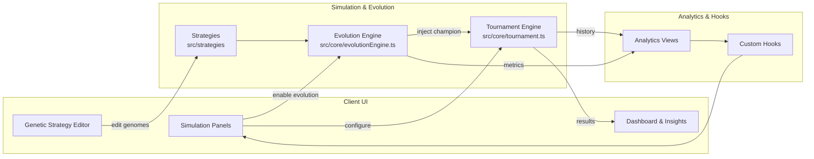




# Game Theory Lab

Interactive React/Vite sandbox for the Iterated Prisoner's Dilemma. Configure tournaments, evolve new competitors, and analyse how cooperation emerges (or collapses) across repeated play.

> 🔗 **Live demo:** [umutdinceryananer.github.io/My-Game-Theory-Lab](https://umutdinceryananer.github.io/My-Game-Theory-Lab/)

---

## Table of contents

1. [Quick start](#quick-start)
2. [Feature tour](#feature-tour)
3. [Project structure](#project-structure)
4. [Architecture overview](#architecture-overview)
5. [Running locally](#running-locally)
6. [Testing & linting](#testing--linting)
7. [Production build](#production-build)
8. [Configuration guide](#configuration-guide)
9. [Deployment](#deployment)
10. [Roadmap](#roadmap)
11. [Contributing](#contributing)
12. [License](#license)

---

## Quick start

```bash
git clone https://github.com/umutdinceryananer/My-Game-Theory-Lab.git
cd My-Game-Theory-Lab
npm install
npm run dev
```

Vite prints a local URL (default: http://localhost:5173). Open it—keeping DevTools visible lets you watch tournament logs in real time.

---

## Feature tour

| Area | What you can do | Key files |
| --- | --- | --- |
| **Tournament engine** | Run single/double round-robin or Swiss tournaments, add noise, review standings | `src/core` |
| **Strategy catalog** | Mix classic strategies (Tit-for-Tat, Always Defect, etc.) with your custom implementations | `src/strategies` |
| **Genetic strategy editor** | Create or edit genomes: tweak responses, last-move conditions, weightings, mutation rates | `src/components/genetic` |
| **Evolution mode** | Let a genetic algorithm iterate on genomes; champion strategies are injected into tournaments | `src/core/evolution*` |
| **Analytics dashboards** | Inspect standings, head-to-head heat maps, Swiss round breakdowns, evolution metrics | `src/components/analytics`, `src/components/dashboard` |
| **Onboarding experience** | Landing screen summarises features and quick steps before dropping into the dashboard | `src/components/landing-screen.tsx` |

---

## Project structure

```text
My-Game-Theory-Lab/
├─ src/
│  ├─ core/              # Tournament engine, evolution logic
│  ├─ strategies/        # Classic and genetic strategy definitions
│  ├─ components/
│  │  ├─ dashboard/      # Main dashboard + insights
│  │  ├─ panels/         # Simulation/evolution control panels
│  │  ├─ genetic/        # Genetic strategy editor UI
│  │  ├─ analytics/      # Charts and summary cards
│  │  └─ ui/             # Shared shadcn/ui wrappers
│  ├─ hooks/             # Reusable data hooks (analytics, tooltips)
│  └─ lib/               # Utilities, export helpers, rating logic
├─ public/               # Static assets served as-is
├─ dist/                 # Production build output (generated)
├─ package.json          # npm scripts and dependencies
├─ vite.config.ts        # Vite configuration (base path, plugins)
└─ README.md             # This guide
```

---

## Architecture overview



---

## Running locally

### Simulation controls at a glance

- **Rounds per match:** Choose 1–1000 to test short vs. long horizons.
- **Noise toggle:** Flip moves at a configurable probability to simulate miscommunication.
- **Payoff matrix:** Edit temptation/reward/punishment/sucker values or load presets.
- **Tournament format:** Switch between single/double round-robin or Swiss (with rounds/tie-breakers).
- **Evolution:** Enable to let the genetic engine iterate on available genomes before each tournament.

### Useful scripts

| Command | Description |
| --- | --- |
| `npm run dev` | Launch Vite dev server |
| `npm run build` | Type-check and build production bundle |
| `npm run preview` | Preview the built `dist/` output |
| `npm run typecheck` | Run TypeScript compiler in `--noEmit` mode |
| `npm run lint:strict` | ESLint with React Hooks / TypeScript rules |
| `npm run test` | Vitest unit suite |
| `npm run test:coverage` | Vitest with v8 coverage report |

---

## Testing & linting

```bash
npm run lint:strict      # ESLint (TypeScript + React Hooks best practices)
npm run typecheck        # TypeScript compiler checks
npm run test             # Vitest unit tests
npm run test:coverage    # Vitest + coverage instrumentation
```

Coverage reports are written to the `coverage/` folder (text summary plus HTML).

---

## Production build

```bash
npm run build
npm run preview   # optional: serve dist/ locally
```

The production bundle lives under `dist/`. GitHub Pages deployment copies `index.html` to `404.html` so client-side routing works on refresh.

---

## Configuration guide

Want to tinker? Start here:

- **UI theming:** Modify design tokens in `src/index.css` and `tailwind.config.ts`.
- **Reusable components:** Export new shadcn/ui atoms in `src/components/ui`.
- **Strategies:** Extend `src/strategies/index.ts` or add new files in `src/strategies`—they automatically appear in the roster.
- **Genetic defaults:** Edit `src/strategies/genetic/introductoryGenetic.ts` to change the starting genome or GA rates.
- **Evolution settings:** Adjust defaults in `src/App.tsx` (population size, operators, mutation/crossover rates).

---

## Deployment

### GitHub Pages (automated)

- Workflow: [.github/workflows/deploy.yml](.github/workflows/deploy.yml)
- Trigger: every push to `main`
- Steps: install dependencies → build → copy `index.html` → `404.html` → upload artifact → deploy with `actions/deploy-pages`
- Live URL: https://umutdinceryananer.github.io/My-Game-Theory-Lab/
- Vite config: `base` is set to `/My-Game-Theory-Lab/` for repo-subpath hosting.

### Manual

```bash
npm run build
cp -r dist/ /your/static/server
```

Serve `dist/` with any static host (Vercel, Netlify, Cloudflare Pages, etc.). Remember to configure SPA fallback to `/index.html`.

---

## Roadmap

- Evolution analytics: richer charts for genome convergence, mutation impact, round-by-round fitness.
- Strategy insights: additional dashboards for head-to-head differentials and payoff distributions.
- Import/export: shareable strategy bundles and evolutionary run snapshots.
- AI opponents: plug in reinforcement-learning agents for more adaptive competition.

---

## Contributing

Contributions, bug reports and feature requests are welcome! To contribute:

1. Fork the repository and create a feature branch from `main`.
2. Make your changes and run the quality gates:
   ```bash
   npm run lint:strict
   npm run test
   npm run build
   ```
3. Open a pull request describing the motivation and behaviour change.

If you simply want to share an idea or report a bug, open an issue instead.

---

## License

This project is licensed under the [MIT License](LICENSE). Have fun exploring cooperation! 🙌
